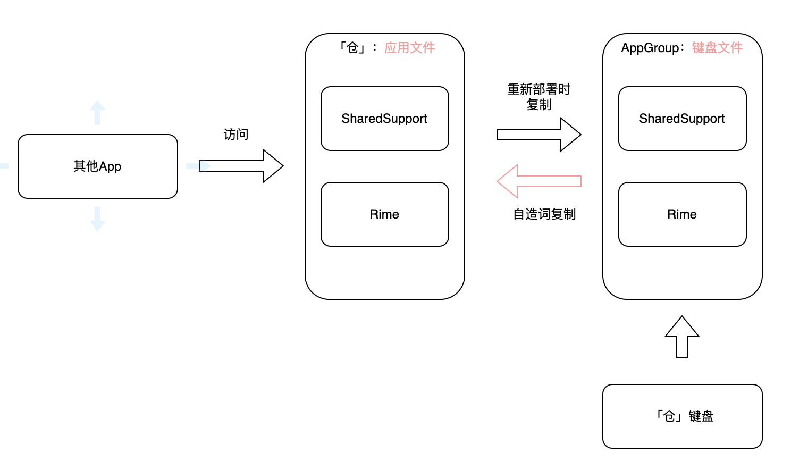

# 文件管理

「仓」与「仓」键盘的输入方案存放在两个不同的路径：「键盘文件」、「应用文件」，如下图所示：

每个路径下都有以下两个目录：

* `SharedSupport`：初始安装时会存放：`opencc` 相关文件、`default.yaml`引擎配置文件、`hamster`开头的应用默认配置文件。
* `Rime`：初始安装时会内置「雾凇输入方案」。

    如果您想上传自己喜欢的输入方案，可以将方案上传至`Rime`目录下。

    > 注意：如果您的方案中依赖「明月」等输入方案，也需要上传依赖方案。

注意：

1. 「键盘文件」是「应用文件」的复制，且「应用文件」提供外部应用访问功能。所以您对配置文件的调整，都应在「应用文件」中进行。
2. 当使用键盘生成「自造词」文件时，「仓」提供了两种方式用来复制「自造词」：

    1. 手工方式：使用「拷贝键盘词库文件至应用」功能，手工将「自造词」文件复制到「应用文件」路径下。
        > 注意：「重新部署」功能会使用「应用文件」覆盖「键盘文件」，所以请在「重新部署」前执行此功能。
    2. 自动方式：在「RIME」功能下，提供了「部署时覆盖键盘词库文件」选项，在关闭后，每次「重新部署」执行时，都会先复制「键盘文件」下的自造词文件。

<!-- ## 文件管理功能

「仓」的文件管理功能提供了对文本文件的**简单**编辑功能，方便用户对输入方案中的文本文件做调整。当然它的功能比不过专业的文本编辑器，所以复杂的文件配置调整建议在 PC 上做。

同时，文件的新增、批量删除、重命名等操作，可以通过系统内置的`文件`应用实现。

点击进入「方案文件管理」功能页面，可以看到「通用」，「应用文件」，「键盘文件」三个标签栏。如果您开启了 `iCloud同步` 功能，还可以看到「iCloud」标签。 -->

<!-- ### 通用设置

#### 拷贝键盘词库文件至应用

点击「拷贝键盘词库文件至应用」，它会把「键盘文件」的自造词文件（后缀为`txt`的文件或目录名后缀为`.userdb`下的文件）复制到「应用文件」中。

<!-- > 注意：「RIME」功能下有个「部署时覆盖键盘词库文件」开关，是这里功能的「自动版」。
> 当关闭这个选项后，每次「RIME 重新部署」时，会自动先把`AppGroup`下后缀为`txt`的文件或目录名后缀为`.userdb`下的文件复制到「应用文件」中，然后在覆盖`AppGroup`目录下的`SharedSupport`目录与`Rime`目录。

「使用键盘文件覆盖应用文件」，这个没啥特别的，就是字面含义。 -->

<!-- ### 应用文件与键盘文件

这里提供了两种方式复制「自造词」文件： --> 

<!-- 经过上面的介绍，我们已经知道「应用文件」「键盘文件」的区别和含义了。所以当我们需要调整某个输入方案的配置时，我们应该修改「应用文件」下的文件，而非「键盘文件」下的文件。

如果您还不清楚为什么？请移步到上面的[`应用文件`与`键盘文件`]章节，并仔细阅读。

这里需要注意一点：任何配置文件的调整，在调整完毕后，需要运行「RIME」-> 「重新部署」。 -->

<!-- 应用文件与键盘文件在不同的路径下，供「仓」与「仓」键盘使用。

* 当需要调整某个输入方案的配置时，请调整「应用文件」目录下的文件，在修改完毕后，需要运行「RIME」下的「重新部署」。
* 当您使用输入方案中的自造词功时，「键盘文件」

### 键盘文件 -->

<!-- ## 输入方案文件如何存放 -->

<!-- 首先，我们需要知道： -->

<!-- 1. 输入方案之间可以有依赖关系。比如 A 输入方案可以依赖 B 输入方案，并在 B 的基础上提供 B 中没有的功能。 于是 B 输入方案就可以作为基础方案，供其他的方案使用。
2. 输入方案的之间都某些功能，存在重复文件，比如输入方案中的「简繁切换」需要使用的 `opencc`文件，候选文件的「emoji」00等功能，他们需要的文件可能是相同的。

基于以上两点的需求，我们可以把这些重复相同的文件放在一个「公共区域」，而把不能共用的文件放在「用户区域」，从而达到文件复用的目的，间接也能达到减少磁盘占用的目的。

在「RIME」的引擎设计中，可以分别指定「公共区域」的目录和「用户区域」的目录。在「仓」中，「公共区域」指 `SharedSupport` 目录，「用户区域」指 `Rime` 目录。 -->

<!-- 在「仓」中， -->

<!-- 如果您不想使用内置输入方案，可以删除 `Rime` 目录下的全部文件，并上传自己的输入方案至`Rime`目录。（为了更加便捷的操作，也可以先删除 `Rime` 目录，然后把自己的方案上传至新建的 `Rime` 目录中。） -->

<!-- 注意，「仓」为了减少应用安装包的体积，「公共区域」的`SharedSupport`目录下没有输入方案，所以有依赖「明月输入方案」的输入方案，也就需要自行上传「明月输入方案」。 -->

<!-- ## 应用文件与键盘文件的区别

由于 iOS 系统的安全限制，每个应用的文件都是存放在自己的沙盒路径下，彼此之间无法访问对方的目录文件。

> 这里说法可能不严谨，iOS 也提供了一些方法使 app 之间可以访问彼此的沙盒目录下的文件，但不适用「仓」，这里仅是为了说明「仓」的存储文件的逻辑。

「仓」输入法应用（以下简称「仓」） 与「仓」键盘，您可以理解为是两个不同的应用（「仓」键盘正确的说法叫「扩展应用」）。于是，我们在「仓」中存放的输入方案文件（即`SharedSupport`,`Rime`两个目录下的文件），「仓」键盘是无法访问的。

iOS 针对这种情况，提供了`AppGroup`的功能，您可以理解为共享目录，在`AppGroup`下的文件，「仓」与「仓」键盘就可以读取到。

> 注意：`AppGroup`目录下的文件，「仓」键盘只有读权限，没有写权限，除非开启键盘的「完全访问权限」后，「仓」键盘才拥有写权限。
> 所以使用自造词功能的用户，需要为键盘开启「完全访问权限」后，自造词才能保存到磁盘中。
> 对于使用可以调整词频的输入方案的用户，也需要开启「完全访问权限」后，词频才能保存。

但`AppGroup`有个问题，无法开放给第三方应用访问。比如，您无法使用系统内置的「文件」应用去管理「仓」的输入法文件，也无法使用第三方的文件编辑器（如：Textastic 等）去编辑「仓」的文件。

为了满足上述需求，「仓」是这样设计文件存储的：

1. 「仓」将输入方案存储在自己的沙盒目录下，并添加了应用配置声明，这样系统应用的「文件」及第三方的文件编辑器（如：Textastic 等）就可以访问「仓」的文件了。
2. 同时，「仓」在每次「重新部署」时，会将自己沙盒目录下的 `SharedSupport`，`Rime`目录复制到`AppGroup`目录下，这样「仓」键盘也可以访问了输入方案的文件了。

现在解释下`应用文件`与`键盘文件`：

* `应用文件`：指「仓」沙盒目录下的文件。
* `键盘文件`：指`AppGroup`下的文件。

 -->